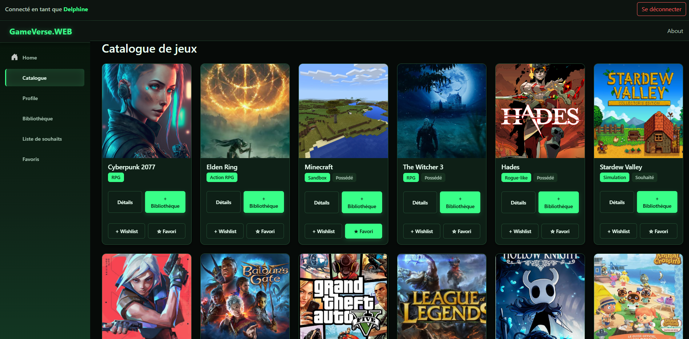
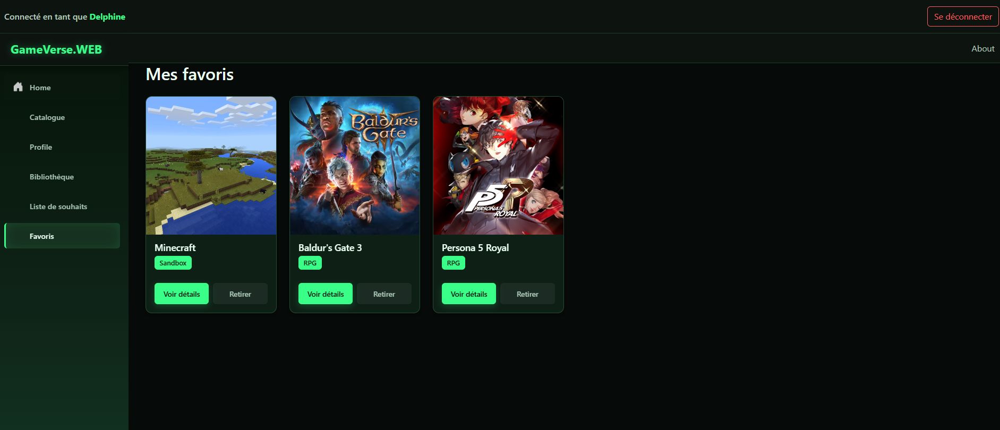
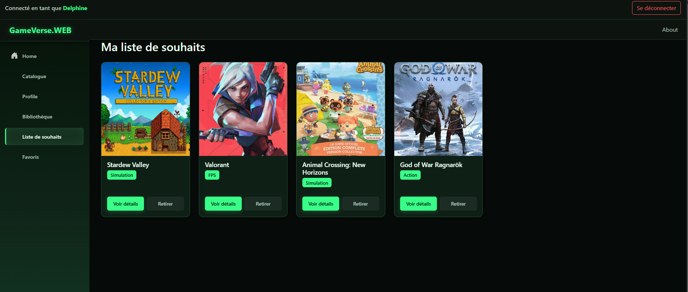
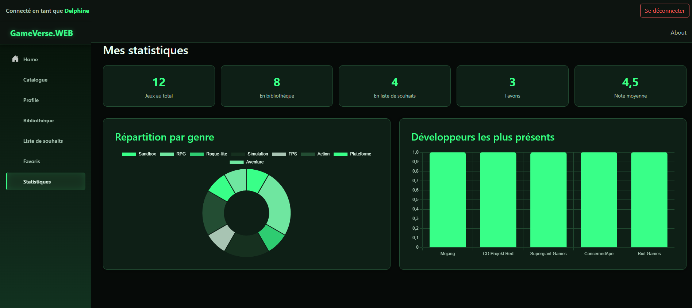

# 🖥 GameVerse.WEB

Client **Blazor WebAssembly** consommant l'API GameVerse, avec authentification JWT complète et thème visuel custom.

[⬅ Retour au README principal](../README.md)

---

## 📑 Sommaire

- [Structure du projet](#-structure-du-projet-web)
- [Authentification Web](#-authentification-web)
- [Stabilisation de l'authentification (WASM)](#-stabilisation-de-lauthentification-wasm)
- [Captures d'écran](#-captures-décran)
- [Statistiques](#-statistiques)

---

## 🗂 Structure du projet Web

```
GameVerse.WEB/
│
├── Pages/
│   ├── GameDetails.razor
│   ├── Home.razor
│   ├── Login.razor
│   ├── Register.razor
│   ├── Profile.razor
│   ├── ProfileEdit.razor
│   ├── Library.razor
│   ├── Wishlist.razor
│   ├── Favorites.razor
│   ├── Catalog.razor
│   ├── Stats.razor
│   └── NotFound.razor
│
├── Components/
│   └── ConfirmModal.razor
│
├── Layout/
│   ├── MainLayout.razor
│   └── NavMenu.razor
│
├── Services/
│   ├── AuthState.cs
│   ├── AuthHeaderHandler.cs
│   ├── CustomAuthStateProvider.cs
│   ├── AuthService.cs
│   └── GameService.cs
│
└── Program.cs
```

---

## 🔐 Authentification Web

L'application **GameVerse.WEB** utilise une authentification basée sur **JWT**, fournie par l'API **GameVerse.API**.
Lorsqu'un utilisateur se connecte, un jeton JWT est stocké côté client et utilisé pour toutes les requêtes protégées.

### 🎮 Espace utilisateur

- Profil (consultation et **édition** : username, email)
- Bibliothèque de jeux
- Wishlist
- Favoris (indépendants du statut de possession — un jeu en bibliothèque *ou* en wishlist peut être marqué favori)
- Catalogue de jeux avec statut visuel (possédé / souhaité / favori) et actions d'ajout directes
- Confirmation avant suppression (modal) sur toutes les listes
- Notifications toast pour le feedback des actions (ajout, favori)
- Notation des jeux possédés (sélecteur 0-10) directement depuis la page de détails, avec sauvegarde immédiate

La navigation s'adapte automatiquement à l'état de connexion :

#### 🔓 Utilisateur non connecté
- Home
- Register
- Login

#### 🔒 Utilisateur connecté
- Home
- Profil
- Bibliothèque
- Wishlist
- Favoris
- Déconnexion

### 🛡 Protection des pages

Les pages sensibles sont protégées via l'attribut Razor :

```razor
@attribute [Authorize]
```

---

## 🐛 Stabilisation de l'authentification (WASM)

Plusieurs bugs classiques de Blazor WebAssembly ont été résolus :

- **Token non attaché aux requêtes** → ajout d'un `DelegatingHandler` (`AuthHeaderHandler`) injectant automatiquement le header `Authorization` via `IHttpClientFactory`.
- **401/400 intermittents** → incohérence entre le claim `"sub"` du JWT et `ClaimTypes.NameIdentifier` utilisé côté API. Centralisé via une extension `ClaimsPrincipalExtensions.GetUserId()`.
- **Perte de session au refresh de page** → `AuthState` persiste le token en `localStorage` (via `IJSRuntime`), restauré au démarrage avant tout rendu (`App.razor`).
- **Comportement incohérent selon la page visitée** → `AuthState` passé en `Singleton` pour garantir une instance unique partagée par le pipeline `IHttpClientFactory`.
- **Refresh token automatique** → à l'expiration du JWT (401), `AuthHeaderHandler` déclenche un refresh silencieux via `api/auth/refresh` et rejoue la requête originale avec le nouveau token. Si le refresh échoue (refresh token expiré/révoqué), l'utilisateur est déconnecté et redirigé vers `/login`. Un verrou (`SemaphoreSlim`) évite les refresh concurrents en cas de requêtes API simultanées.

> ⚠️ **Limite connue** : le refresh token est stocké en `localStorage`, donc potentiellement exposé en cas de faille XSS. Une évolution possible serait de le déplacer en cookie `HttpOnly` posé directement par l'API (nécessite une refonte CORS/cookies).

---

## 📸 Captures d'écran

<table>
  <thead>
    <tr>
      <th align="center" width="50%">Accueil</th>
      <th align="center" width="50%">Profil</th>
    </tr>
  </thead>
  <tbody>
    <tr>
      <td align="center"></td>
      <td align="center"></td>
    </tr>
    <tr>
      <th align="center">Bibliothèque</th>
      <th align="center" width="50%">Détails</th>
    </tr>
    <tr>
      <td align="center"></td>
      <td align="center"></td>
    </tr>
    <tr>
      <th align="center">Catalogue</th>
      <th align="center" width="50%">Favoris</th>
    </tr>
    <tr>
      <td align="center"></td>
      <td align="center"></td>
    </tr>
    <tr>
      <th align="center">Souhaits</th>
      <th align="center" width="50%">Statistiques</th>
    </tr>
    <tr>
      <td align="center"></td>
      <td align="center"></td>
    </tr>
  </tbody>
</table>

### 📊 Statistiques

Page dédiée (`/stats`) affichant la collection de l'utilisateur sous forme de graphiques :
- Répartition des jeux par genre (graphique en anneau)
- Développeurs les plus représentés dans la collection (graphique en barres)
- Compteurs synthétiques (total, bibliothèque, wishlist, favoris, note moyenne)

Les graphiques sont rendus via **Chart.js**, intégré en JS interop (`wwwroot/js/charts.js`), appelé depuis le code-behind Blazor via `IJSRuntime`.

[⬅ Retour au README principal](../README.md)