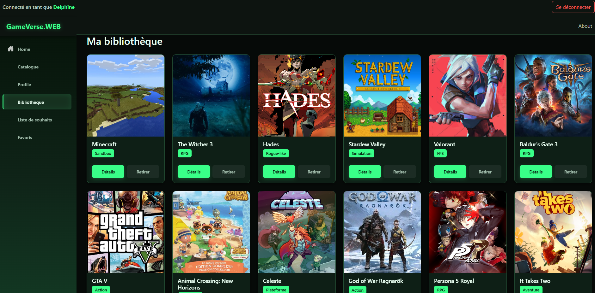

# 🎮 GameVerse

Application complète de gestion de bibliothèque de jeux vidéo, développée en **.NET 10** avec une architecture API + Web séparée.


> 🔗 **Démo live** : <video src="./docs/images/Gameverse.mp4" width="100%" controls autoplay muted loop></video>


---

## 🗂 Architecture du projet

Le projet est structuré en trois projets distincts :

| Projet | Description | Documentation |
|---|---|---|
| **GameVerse.API** | API RESTful (.NET 10, EF Core, Azure SQL, JWT) | [📄 README API](GameVerse.API/README.md) |
| **GameVerse.WEB** | Client Blazor WebAssembly | [📄 README WEB](GameVerse.WEB/README.md) |
| **GameVerse.Tests** | Tests unitaires (xUnit, EF Core InMemory) 43 tests | [📄 README Tests](GameVerse.Tests/README.md) |

---

## 🚀 Aperçu des fonctionnalités

- 👤 Authentification sécurisée (JWT + refresh token)
- 🎮 Gestion complète d'une bibliothèque de jeux (CRUD, wishlist, favoris)
- 🔐 Sécurité renforcée (BCrypt, DTOs, HTTPS, secrets protégés)
- 🗄 Base de données Azure SQL avec Entity Framework Core
- ✔ Validation via FluentValidation
- 📘 Documentation API interactive (Scalar)

---

## 📸 Aperçu visuel

<table>
  <thead>
    <tr>
      <th align="center" width="50%">Accueil</th>
      <th align="center" width="50%">Bibliothèque</th>
    </tr>
  </thead>
  <tbody>
    <tr>
      <td align="center"></td>
      <td align="center"></td>
    </tr>
  </tbody>
</table>

*(Voir les READMEs détaillés pour l'ensemble des captures)*

---

## 🧱 Stack technique

**Backend** : .NET 10 · Entity Framework Core · Azure SQL · JWT · FluentValidation · AutoMapper  
**Frontend** : Blazor WebAssembly · CSS custom (design system maison) · Chart.js (visualisation de données)  
**Infra** : Azure App Service · Docker


---

## 🚀 Démarrage rapide

```bash
git clone https://github.com/<ton-user>/GameVerse.git
cd GameVerse
```

Voir les instructions détaillées dans les READMEs de chaque projet.

---

## 📄 Licence MIT