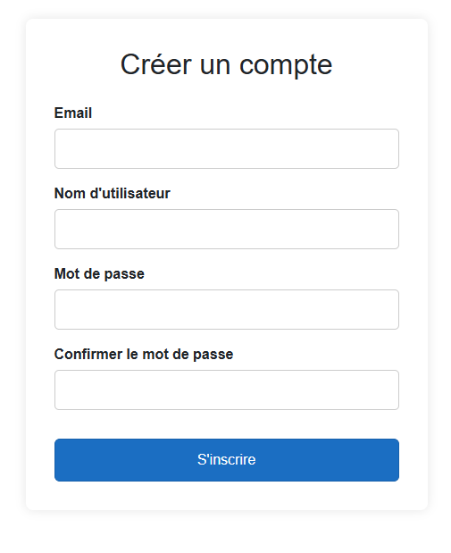
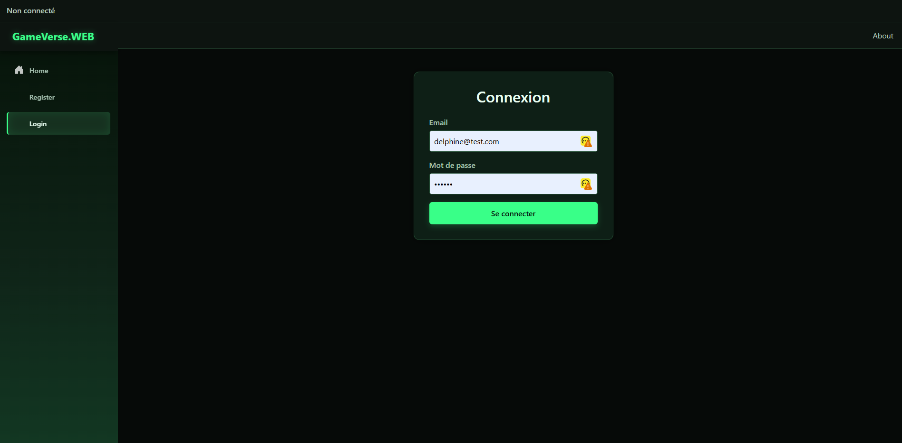
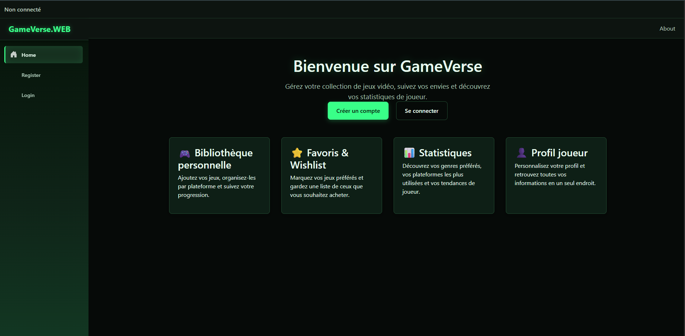
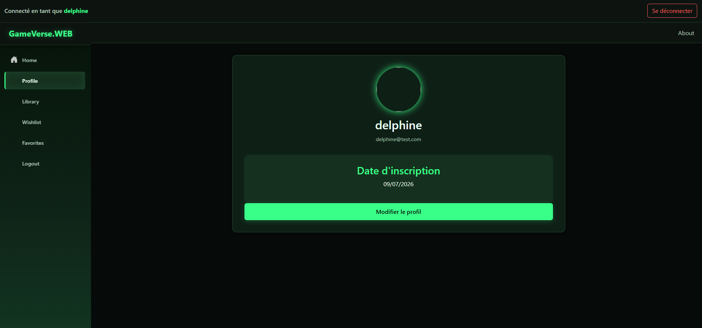
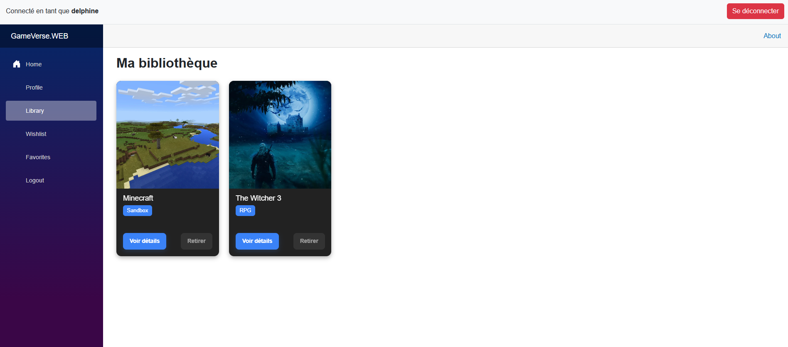
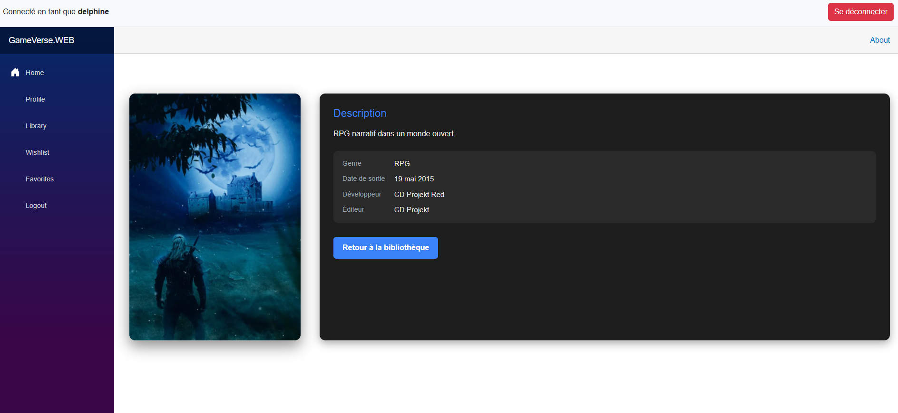
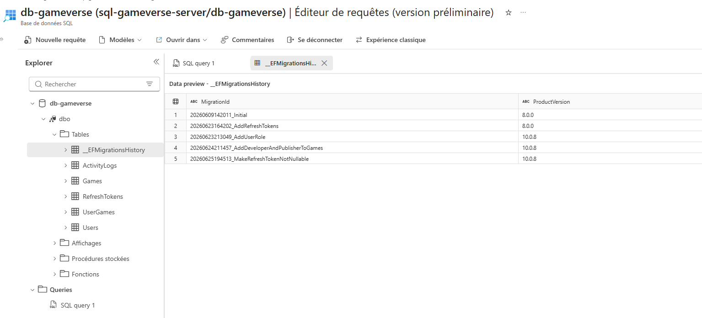

# 🎮 GameVerse API  
API RESTful développée en **.NET 10**, permettant de gérer des utilisateurs, des jeux vidéo et leurs relations (wishlist, favoris, bibliothèque, etc.).  
Le projet utilise **Entity Framework Core** et une base **Azure SQL**.


---
 
<table>
  <thead>
    <tr>
      <th align="center" width="50%">Inscription</th>
      <th align="center" width="50%">Connexion</th>
     
    </tr>
  </thead>
  <tbody>
    <tr>
      <td align="center"></td>
      <td align="center"></td>
    </tr>
    <tr>
      <th align="center">Accueil</th> 
      <th align="center" width="50%">Profil</th>
    </tr>
    <tr>
      <td align="center"></td>
      <td align="center"></td>
    </tr>
    <tr>
      <th align="center" width="50%">Librairy</th>
      <th align="center" width="50%">Details</th>
    </tr>
    <tr>
      <td align="center"></td>
      <td align="center"></td>
    </tr>
  </tbody>
</table>

---

## 🚀 Fonctionnalités

### 👤 Gestion des utilisateurs
- Inscription & connexion  
- Récupération, mise à jour et suppression d’un utilisateur  
- Authentification sécurisée via **JWT**

### 🎮 Gestion des jeux
- CRUD complet  
- DTOs dédiés (Create, Update, Read)  
- AutoMapper configuré  
- Endpoints sensibles protégés

### ❤️ Relations User ↔ Game
- Ajout d’un jeu à un utilisateur (wishlist, favoris, owned…)  
- Mise à jour de la relation (type, rating)  
- Suppression d’un jeu de la bibliothèque  
- Listing des jeux d’un utilisateur (dont favoris)  
- DTOs dédiés

### 🔐 Sécurité & Secrets
- **User Secrets Manager** activé  
- Connexion Azure SQL sécurisée  
- `.gitignore` renforcé (secrets, env, appsettings, bin/obj…)

### 🗄 Base de données Azure SQL
- Base **GameVerse** déployée sur Azure  
- Migration initiale appliquée  
- Tables : `Users`, `Games`, `UserGames`, `__EFMigrationsHistory`

### 🧱 Entity Framework Core
- Contexte `GameVerseContext`  
- Clé composite pour `UserGame`  
- Relation Many-to-Many configurée via Fluent API  
- Migration `Initial` appliquée avec succès

### ✔ Validation (FluentValidation)
- Suppression des DataAnnotations  
- Validateurs dédiés par entité  
- Pipeline global (`ValidationFilter`) renvoyant automatiquement les erreurs en **400 Bad Request**

### 📘 Documentation (Scalar)
- Intégration OpenAPI (`AddOpenApi`)  
- Interface Scalar moderne accessible via `/scalar`

---

## 🗂 Structure du projet

```
GameVerse/
│
├── GameVerse.API/
│   ├── Controllers/
│   │   ├── AuthController.cs
│   │   ├── UsersController.cs
│   │   ├── GamesController.cs
│   │   └── UserGamesController.cs
│   │
│   ├── DTOs/
│   │   ├── Auth/
│   │   ├── Games/
│   │   ├── Users/
│   │   └── UserGames/
│   │
│   ├── Services/
│   │   ├── Interfaces/
│   │   ├── AuthService.cs
│   │   ├── UserService.cs
│   │   ├── GameService.cs
│   │   └── UserGameService.cs
│   │
│   ├── Mappings/
│   │   └── AutoMapperProfile.cs
│   │
│   ├── Data/
│   │   └── GameVerseContext.cs
│   │
│   ├── Models/
│   │   ├── User.cs
│   │   ├── Game.cs
│   │   └── UserGame.cs
│   │
│   ├── Program.cs
│   └── appsettings.json
│
└── README.md

```

---

## 🔌 Connexion à la base Azure SQL

La chaîne de connexion est stockée dans les **User Secrets** :

```json
{
  "ConnectionStrings": {
    "DefaultConnection": "Server=tcp:<server>.database.windows.net,1433;Initial Catalog=GameVerse;User ID=<user>;Password=<password>;Encrypt=True;"
  }
}
```

---

## 🧱 Configuration Modèle & Pivot EF Core

### Modèle de données `UserGame`

```csharp
public class UserGame
{
    public int UserId { get; set; }
    public int GameId { get; set; }
    public string RelationType { get; set; } = "Wishlist";
    public DateTime AddedAt { get; set; } = DateTime.Now;
    public int? Rating { get; set; }

    public User? User { get; set; }
    public Game? Game { get; set; }
}
```

### Configuration Fluent API (`GameVerseContext`)

```csharp
protected override void OnModelCreating(ModelBuilder modelBuilder)
{
    // Configuration de la clé primaire composite
    modelBuilder.Entity<UserGame>()
        .HasKey(ug => new { ug.UserId, ug.GameId });

    // Pivot Many-to-Many
    modelBuilder.Entity<UserGame>()
        .HasOne(ug => ug.User)
        .WithMany(u => u.UserGames)
        .HasForeignKey(ug => ug.UserId);

    modelBuilder.Entity<UserGame>()
        .HasOne(ug => ug.Game)
        .WithMany(g => g.UserGames)
        .HasForeignKey(ug => ug.GameId);
}
```

---

## 📸 Migration appliquée sur Azure SQL

Voici la migration EF Core appliquée avec succès sur Azure :



---

## 🔐 Sécurité

### Authentification JWT

L’API utilise un système d’authentification basé sur **JSON Web Tokens (JWT)** pour sécuriser les endpoints.
- Tokens signés de manière cryptographique.
- Validation rigoureuse de l’issuer, de l’audience et de la signature.
- Expiration automatique configurée.

### 🔑 Fonctionnement du flux
- Lors de l’inscription, un utilisateur est créé de manière unique en base de données.
- Lors de la connexion, un **token JWT signé** est généré par le serveur.
- Ce token doit être envoyé dans chaque requête protégée via l’en-tête HTTP suivant :
```http
Authorization: Bearer <token>
```

### ✔ Protection des secrets
- User Secrets activé (aucun jeton ni clé en clair dans le code).
- Aucun secret ou fichier de configuration sensible poussé sur GitHub.
- Connexions Azure SQL cryptées de bout en bout (`Encrypt=True`).

### ✔ HTTPS obligatoire
L’API force l’utilisation et la redirection systématique vers le protocole sécurisé HTTPS.

### ✔ Bonnes pratiques de conception
- Ne jamais stocker les mots de passe des utilisateurs en clair : utilisation de **BCrypt** pour le salage et le hashing.
- Ne jamais exposer les entités EF Core directement sur les contrôleurs afin de prévenir les injections de masse et les fuites de métadonnées (isolation totale via les **DTOs**).
- Architecture logicielle entièrement asynchrone (`async/await`) pour maximiser la disponibilité des threads du serveur web.

---

## 📘 Accès à la Documentation (Scalar)

Le pipeline OpenAPI et l'interface utilisateur Scalar sont initialisés dans le fichier `Program.cs`. 

*   **Adresse locale de développement** : `https://localhost:7000/scalar`

```csharp
builder.Services.AddOpenApi();

// Enregistrement automatique des validateurs du projet
builder.Services.AddValidatorsFromAssemblyContaining<UserGameCreationValidator>();

var app = builder.Build();

app.MapOpenApi();
app.UseScalar(options =>
{
    options.Title = "GameVerse API";
    options.Theme = ScalarTheme.Dark;
});
```

---

## 🚀 Déploiement

### 🌐 Déploiement possible sur :
- Azure App Service
- Azure Container Apps
- Docker + Azure Container Registry
- Kubernetes (AKS)

### 🧪 Étapes de déploiement locales (Docker)
```bash
docker build -t gameverse-api .
docker run -p 8080:80 gameverse-api
```

## 🗂 Structure du projet Web

```bash
 
GameVerse.WEB/
│
├── Pages/
│   ├── GameDetails.razor
│   ├── Home.razor
│   ├── Login.razor
│   ├── Register.razor
│   ├── Profile.razor
│   ├── Library.razor
│   ├── Wishlist.razor
│   ├── Favorites.razor
│   └── NotAuthorized.razor
│
├── Layout/
│   ├── MainLayout.razor
│   └── NavMenu.razor
│
├── Services/
│   ├── AuthState.cs
│   ├── CustomAuthStateProvider.cs
│   └── AuthService.cs
│
└── Program.cs

```

## 🔐 Authentification Web

L’application **GameVerse.WEB** utilise une authentification basée sur **JWT**, fournie par l’API **GameVerse.API**.  
Lorsqu’un utilisateur se connecte, un jeton JWT est stocké côté client et utilisé pour toutes les requêtes protégées.

### 🎮 Espace utilisateur

Une fois authentifié, l’utilisateur accède à son espace personnel :

- Profil
- Bibliothèque de jeux
- Wishlist
- Favoris

La navigation s’adapte automatiquement à l’état de connexion :

#### 🔓 Utilisateur non connecté
- Home  
- Register  
- Login  

#### 🔒 Utilisateur connecté
- Home  
- Profil  
- Bibliothèque  
- Wishlist  
- Favoris  
- Logout  

### 🛡 Protection des pages

Les pages sensibles sont protégées via l’attribut Razor :

```razor
@attribute [Authorize]
```

### 🐛 Stabilisation de l'authentification (WASM)

Plusieurs bugs classiques de Blazor WebAssembly ont été résolus :

- **Token non attaché aux requêtes** → ajout d'un `DelegatingHandler` (`AuthHeaderHandler`) injectant automatiquement le header `Authorization` via `IHttpClientFactory`.
- **401/400 intermittents** → incohérence entre le claim `"sub"` du JWT et `ClaimTypes.NameIdentifier` utilisé côté API. Centralisé via une extension `ClaimsPrincipalExtensions.GetUserId()`.
- **Perte de session au refresh** → `AuthState` persiste désormais le token en `localStorage` (via `IJSRuntime`), restauré au démarrage avant tout rendu (`App.razor`).
- **Comportement incohérent selon la page visitée** → `AuthState` passé en `Singleton` pour garantir une instance unique partagée par le pipeline `IHttpClientFactory` (cohérent avec une SPA à session unique).